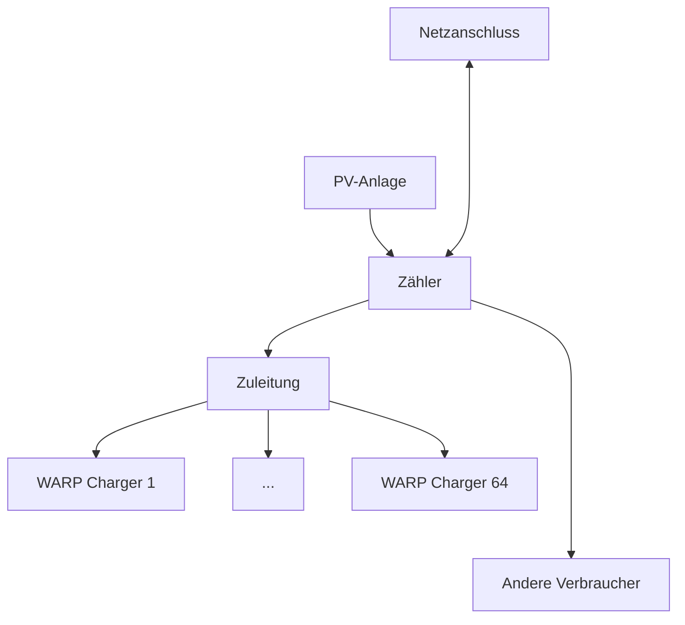

# Lastmanagement-Details

:::danger

Für Konfiguration und Betrieb des Lastmanagements und PV-Überschussladens ist es **nicht** notwendig, diese Unterseite zu lesen und/oder zu verstehen! Diese Unterseite dokumentiert interna des Designs und Verhaltens des statischen und dynamischen Lastmanagements und des PV-Überschussladens.

:::

Das Lastmanagement kann über einen [kompatiblen Stromzähler](/compatible_devices/devices.md) den Netzanschluss überwachen und bietet damit folgende Funktionen, die einzeln oder kombiniert verwendet werden können:

- **Dynamisches Lastmanagement**: Der Lastmanager stellt sicher, dass der Netzanschluss nicht überlastet wird, auch wenn andere (ungesteuerte) Verbraucher den Netzanschluss dynamisch belasten.
- **PV-Überschussladen**: Der Lastmanager stellt sicher, dass nur der PV-Überschuss verwendet wird, um Fahrzeuge zu laden.
- **Statisches Lastmanagement**: Der Lastmanager stellt sicher, dass die gemeinsame Zuleitung des Wallbox-Verbunds nicht überlastet wird.

Die Implementierung balanciert mehrere Anforderungen:
- Fairness
- Regelspielraum
- Ausnutzung des PV-Überschusses
- Minimierung von Ein-, Um- und Abschaltungen
- Schnelle Reaktion auf neu angesteckte Fahrzeuge
- Schnelle Reaktion auf Überlast am Netzanschluss

Das Lastmanagement ist in zwei Komponenten aufgeteilt: Der Regler bestimmt Stromlimits, die angeben, wie viel PV-Überschuss zur Verfügung steht und wie stark die drei Phasen belastet werden dürfen. Der Verteilungsalgorithmus verwendet diese Stromlimits, um den Wallboxen Strom zuzuweisen.

## Stromlimits

Stromlimits bestehen jeweils aus einem PV-Überschuss und drei Phasenwerten (L1, L2, L3).

Die Stromlimits, die vom Regler bestimmt werden, sind:
- `raw`: Der Strom, der in diesem Moment verwendet werden darf.
- `min`: Der minimal verfügbare Strom der letzten Minuten. Die Wolkenfilter-Konfiguration legt für den `min`-PV-Wert fest, wie weit in die Vergangenheit der Wert bestimmt wird. Für die Phasenwerte wird immer das Minimum der letzten vier Minuten verwendet.
- `max_pv`: Der maximal verfügbare PV-Überschuss der letzten Minuten. Wird ebenfalls vom Wolkenfilter definiert.
- `spread`: Ein Wert, der vorhersagt, wie viele Wallboxen gleichzeitig aktiv sein können. Im Moment implementiert als der minimal verfügbare Strom der letzten Stunde.

## Regler

Wenn PV-Überschussladen oder dynamisches Lastmanagement aktiv sind, wird der verfügbare Strom, der vom Lastmanagement verteilt werden darf, durch zwei Regler berechnet, die Teil des Power Manager-Moduls sind.

Der PV-Regler ist ein P-Regler mit adaptiver Schrittweite, der bei großen Abweichungen stark reagiert, um beispielsweise auf große Verbraucher oder plötzlich ändernde Bewölkung schnell reagieren zu können, und andererseits auf kleine Abweichungen nur schwach reagiert, um starke Oszillationen zu vermeiden, wenn ein angeschlossenes Fahrzeug seine Ladeleistung nur in großen, diskreten Schritten anpassen kann. Sollwert des Reglers ist üblicherweise null Watt am Hausanschluss, jedoch kann der Wert bei Bedarf angepasst werden, um bevorzugt Strombezug oder Stromeinspeisung zu vermeiden. Da die zur Verfügung stehende Menge Energie beim PV-Überschussladen bei bewölktem Wetter ständig schwankt, lässt sich durch die Stärke des Wolkenfilters einstellen, wie schnell aufgrund von sich ändernder Bewölkung bzw. Sonneneinstrahlung Wallboxen ein-, aus- oder umgeschaltet werden sollen. Ein schwacher Wolkenfilter führt zu häufigeren Schaltvorgängen, durch die die tatsächliche PV-Leistung besser ausgenutzt werden kann, aber auch die Ladeelektronik der angeschlossenen Fahrzeuge stärker verschlissen wird. Ein starker Wolkenfilter schont die Ladeelektronik mehr, führt aber zu mehr Strombezug oder -einspeisung, wenn die Fahrzeuge nicht auf die momentane PV-Leistung eingestellt werden können. Die Werte des Wolkenfilters werden als `min` und `max_pv` an das Lastmanagement übergeben. Solange sich die Ladeleistung im mittleren Bereich von Wallbox und Fahrzeug befindet, hat der Wolkenfilter keinen Einfluss.

Der Regler für dynamisches Lastmanagement ist ebenfalls ein P-Regler mit adaptiver Schrittweite, der bei Überschreitung des eingestellten Phasenlimits stark reagiert, um ein Auslösen der Sicherungen zu vermeiden. Unterhalb des eingestellten Phasenlimits nähert er sich langsam dem Limit, um bei Verbrauchern mit gepulstem Stromverbrauch, wie z. B. Microwellen, mehr Sicherheitsabstand zu lassen. An Informationen über den zu überwachenden Netzanschluss werden der Nennwert der Absicherung sowie der größte zu erwartende Fremdverbraucher im Gebäude benötigt. Ein typischer Wert für die Absicherung des Netzanschlusses ist 63 A. Ein großer Fremdverbraucher kann ein 27 kW Durchlauferhitzer sein, bei dem mit einem plötzlich auftretenden Stromverbrauch von 39 A gerechnet werden muss. In diesem Fall darf das dynamische Lastmanagement den Netzanschluss nur mit 49 A belasten, da der Durchlauferhitzer jederzeit eingeschaltet werden könnte und die Absicherung nur begrenzt überlastfähig ist. Für jede Phase wird einzeln das Minimum der letzten vier Minuten berechnet und als `min` an das Lastmanagement übergeben, um abschätzen zu können, ob die Kapazität des Netzanschlusses ausreicht, um weitere Wallboxen einzuschalten.

Das dynamische Lastmanagement verwendet nicht die momentanen Rohwerte der Phasenströme, da in dem Fall Verbraucher mit stark gepulstem Stromverbrauch entweder keinen oder einen zu starker Einfluss hätten. Stattdessen wird zwischen einem gleitenden Mittelwert der letzten zehn Sekunden und dem gewichteten Maximum aus dem selben Zeitintervall interpoliert. Kleine, gepulste Verbraucher wie Kaffeevollautomaten werden dabei geglättet, große Dauerverbraucher dagegen sofort beachtet.

## Verteilungsalgorithmus

Der Verteilungsalgorithmus arbeitet in neun Stufen, die aus Gründen der Übersicht nicht in dieser Reihenfolge erläutert werden: Es wird zunächst nur die "normale" Verteilung erklärt, Spezialfälle folgen danach. Die neun Stufen sind:

1. Abschalten von Wallboxen, die rotiert werden sollen, oder nicht aktiv sind.
2. Sofortiges Aktivieren von Wallboxen, an denen gerade ein Fahrzeug angesteckt wurde.
3. Abschalten von Wallboxen, bis Phasen- und PV-Limits eingehalten werden.
4. Zuschalten von Wallboxen, bis Phasen- und PV-Limits ausgenutzt werden.
5. Umschalten von ein- auf dreiphasig von Wallboxen, bis Phasen- und PV-Limits ausgenutzt werden.
6. Zuteilen des Minimalstroms an alle aktiven Wallboxen.
7. Zuteilen des fairen Stroms an alle aktiven Wallboxen.
8. Zuteilen des Reststroms an alle aktiven Wallboxen.
9. Aufwecken von Wallboxen mit "vollen" Fahrzeugen.

### Regelfenster

Der Verteilungsalgorithmus verwendet die vom Regler bestimmten Stromlimits und die Statusmeldungen der gesteuerten Wallboxen um zu entscheiden, wie viele und welche Wallboxen laden dürfen und wie viel Strom ihnen zugeteilt wird. Dazu wird das Regelfenster bestimmt, das angibt wie viel Strom von den derzeit aktiven Wallboxen minimal und maximal verteilt werden kann.

Als Beispiel betrachten wir zwei aktive Wallboxen, eine einphasig ladende (mit bekannter Phasenrotation), die nur L1 belastet, und eine dreiphasig ladende.

Das Fensterminimum ist auf jeder Phase die Summe der Minimalströme (typischerweise 6 A) der Wallboxen. Auf der PV-"Phase" muss die Summe der Phasen-Minima ausgegeben werden:

|PV|L1|L2|L3|
|-|-|-|-|
|24 A|12 A|6 A|6 A|

Zugrunde liegt hier die Annahme, dass der dreiphasige Minimalstrom gleich dem einphasigen ist. Das ist der Fall, wenn das `Standard`-Fahrzeugmodell konfiguriert ist.

Das Fenstermaximum hängt vom bestimmten `raw`-Stromlimit ab: Es darf nie mehr Strom verteilt werden, als aktuell zur Verfügung steht. Außerdem darf dreiphasig ladenden Wallboxen nur so viel Strom zugeteilt werden, dass für die einphasigen Wallboxen noch mindestens der Minimalstrom übrig bleibt. Bei einem `raw`-Stromlimit von

|PV|L1|L2|L3|
|-|-|-|-|
|108 A|36 A|36 A|36 A|

können der dreiphasig ladenden Wallbox nicht mehr als 30 A zugeteilt werden, da sonst auf L1 weniger als 6 A für die einphasig ladende Wallbox übrig bleiben würden. Das Fenstermaximum liegt also bei

|PV|L1|L2|L3|
|-|-|-|-|
|96 A|36 A|30 A|30 A|

### Ab-, Zu- und Umschalten von Wallboxen (Stufe 3, 4 und 5)

Nachdem das Regelfenster bestimmt wurde, wird es mit den Stromlimits verglichen um (in dieser Reihenfolge) zu prüfen, ob Wallboxen abgeschaltet werden müssen, zugeschaltet werden können oder von ein- auf dreiphasiges Laden umgeschaltet werden können. Nach jeder Schaltentscheidung wird das Regelfenster neu bestimmt. Es wird hier noch nicht Strom verteilt, stattdessen werden den Wallboxen null (abgeschaltet), eine oder drei Phasen zugewiesen, die sie belasten dürfen.

#### Stufe 3

Wallboxen müssen abgeschaltet werden, wenn das Regelfenster-Minimum auf einer oder mehreren Phasen größer ist als die `raw`-Stromgrenze. Wenn das der Fall ist, dann sind die entsprechenden Phasen überlastet und es muss sofort reagiert werden. Wallboxen werden außerdem abgeschaltet, wenn das PV-Regelfenster-Minimum größer als die `max_pv`-Stromgrenze ist. Hier wird nicht die `raw`-Grenze verwendet, um sicherzustellen, dass bei einem kurzzeitigen Einbruch der PV-Produktion nicht sofort Wallboxen abgeschaltet werden. In diesem Fall kann Strom aus dem Netz bezogen werden, um den kurzen Einbruch zu überbrücken.

#### Stufe 4

Wallboxen können zugeschaltet werden, wenn das Regelfenster-Maximum den verfügbaren Strom nicht komplett aufbrauchen kann. Um eine Wallbox zuzuschalten wird zunächst der **Einschaltstrom** bestimmt. Standardmäßig ist der Einschaltstrom 1,5-mal der Minimalstrom (`enable_current_factor_pct`), also (beim `Standard`-Fahrzeugmodell) 9 A auf jeder Phase, auf der die neue Wallbox aktiv sein wird und die Summe der Phasen-Einschaltströme als PV-Einschaltstrom. Es werden dann drei Bedingungen geprüft:
1. Liegt die `min`-Stromgrenzen mindestens um den Einschaltstrom unter dem Fensterminimum?
2. Gibt die `spread`-Stromgrenze vor, dass die neue Wallbox und alle bereits aktiven Wallboxen hätten aktiv sein können?
3. Liegt das Fenstermaximum mindestens einer Phase unter der entsprechenden `min`-Stromgrenze?
4. Liegt das Fenstermaximum des PV-Werts unter der `min`-Stromgrenze?

Es müssen entweder die Bedingungen 1 und 2 oder 1, 3 und 4 erfüllt sein, damit eine Wallbox aktiviert wird. Auch hier wird nicht die `raw`-Stromgrenze verwendet, um sicherzustellen, dass die Einschalt- und gleich folgenden Umschaltentscheidungen eine gewisse Zeit stabil sind: Es soll lieber eine kurze Zeit eine Phase nicht voll ausgelastet sein, oder etwas PV-Strom ins Netz eingespeist werden, anstatt dass eine Wallbox aktiviert und sofort wieder deaktiviert wird, damit die Hardware von Wallbox und Fahrzeug nicht übermäßig belastet wird.

#### Stufe 5

Eine Wallbox kann von einphasigem auf dreiphasiges Laden umgeschaltet werden, wenn noch Strom verfügbar ist. Die Entscheidung wird fast genauso getroffen wie die, ob eine Wallbox aktiviert werden soll, allerdings wird berücksichtigt, dass die betreffende Wallbox bereits auf einer Phase aktiv ist, und Bedingung 3 muss für die *beiden* anderen Phasen zutreffen.

### Stromverteilung (Stufe 6, 7 und 8)

Nachdem für jede Wallbox bestimmt wurde, ob sie laden darf und wenn ja ob ein- oder dreiphasig, wird allen jetzt aktiven Wallboxen Strom zugewiesen.

#### Stufe 6

Zunächst wird allen Wallboxen der jeweilige Minimalstrom zugewiesen, damit der Ladevorgang weiterläuft bzw. begonnen werden kann. Durch die oben getroffenen Schaltentscheidungen ist sichergestellt, dass für jede Wallbox, der mindestens eine Phase zugewiesen wurde, der Minimalstrom zur Verfügung steht. Die zugeteilten Ströme werden jetzt vom `raw`-Limit abgezogen.

#### Stufe 7

Als nächstes wird ein fairer Strom pro Phase und für den PV-Überschuss bestimmt. Der faire Strom ist das noch übrige `raw`-Limit geteilt durch die Anzahl der Wallboxen, die auf dieser Phase aktiv sind. Beim PV-Überschuss geht eine Wallbox mit der Anzahl ihrer aktiven Phasen ein, damit einphasig ladende Wallboxen nicht benachteiligt werden.

Wenn beispielsweise eine drei- und eine einphasig (auf L1) ladende Wallbox aktiv sind, und das `raw`-Stromlimit *nach Verteilung der Minimalströme* noch

|PV|L1|L2|L3|
|-|-|-|-|
|68 A|50 A|20 A|10 A|

beträgt, dann wird der folgende faire Strom berechnet:

|PV|L1|L2|L3|
|-|-|-|-|
|17 A|25 A|20 A|10 A|

Jeder Wallbox wird das Minimum des fairen PV-Überschuss-Stroms und der fairen Strom der Phasen, auf denen sie aktiv ist, zugewiesen und vom `raw`-Stromlimit abgezogen. Im Beispiel werden also der dreiphasigen Wallbox 10 A (limitiert durch L3) und der einphasigen Wallbox 17 A (limitiert durch PV) zugewiesen.

Das `raw`-Stromlimit beträgt jetzt noch:

|PV|L1|L2|L3|
|-|-|-|-|
|21 A|23 A|10 A|0 A|

#### Stufe 8

Der übrige Strom wird jetzt, möglicherweise unfair, auf die Wallboxen verteilt. Da auf L3 kein Strom mehr zur Verfügung steht, kann der dreiphasig ladenden Wallbox nicht mehr Strom zugewiesen werden. Sie behält also die Zuteilung von 6 A (Minimalstrom) + 10 A (fairer Strom) = 16 A. Die einphasig ladende Wallbox kann noch 21 A PV-Überschuss erhalten, die auf der L1-Phase frei sind. Ihr werden also 6 A (Minimalstrom) + 16 A (fairer Strom) + 21 A (übriger Strom) = 43 A zugewiesen. Dieser Wert wird auf 32 A begrenzt, was das Maximum ist, dass einer (22kW-)Wallbox zugewiesen werden kann.

Das `raw`-Stromlimit beträgt jetzt noch:

|PV|L1|L2|L3|
|-|-|-|-|
|11 A|2 A|10 A|0 A|

### Aufwecken "voller" Fahrzeuge (Stufe 9) {#wakeup}

Aufgrund der limitierten Kommunikation zwischen Fahrzeug und Wallbox kann nicht bestimmt werden, wann ein Fahrzeug voll geladen ist. Wenn ein Fahrzeug während eines laufenden Ladevorgangs diesen beendet, wird deshalb vom Lastmanagement davon ausgegangen, dass das Fahrzeug voll ist, oder aus anderen Gründen (Ladegrenze, Überhitzung) keinen Strom mehr erhalten möchte. Wenn das Fahrzeug den Ladevorgang beendet, wird dessen Wallbox deshalb als niedrig priorisiert betrachtet und im normalen Durchlauf des Verteilungsalgorithmus wird der Wallbox kein Strom zugeteilt.

Falls nach dem Verteilungsdurchlauf noch Strom übrig ist, wird dieser Wallboxen zugeteilt, an denen "volle" Fahrzeuge angeschlossen sind, damit diese gegebenenfalls wieder laden können. Zum Beispiel kann die Standheizung des Fahrzeugs aktiviert worden sein, oder durch Selbstendladung kann das Fahrzeug wieder geladen werden.

Wenn wie im Beispiel oben das `raw`-Stromlimit nach dem Verteilungsdurchlauf noch

|PV|L1|L2|L3|
|-|-|-|-|
|11 A|2 A|10 A|0 A|

beträgt, dann kann einer niedrig priorisierten Wallbox, die einphasig auf L2 laden kann der Einschaltstrom (siehe oben) zugewiesen werden. Falls es mehr niedrig priorisierte Wallboxen gibt, als Strom verfügbar ist, wird nach wenigen Minuten (der `wakeup_time`, standardmäßig drei Minuten) die Wallbox, der der Einschaltstrom zugewiesen wird, gewechselt.

### Rotation von Wallboxen (Stufe 1)

Es kann aufgrund der PV- und Phasenlimits dazu kommen, dass nicht alle Wallboxen, die ladebereit sind, auch Strom erhalten. Um in diesem Fall sicherzustellen, dass alle Fahrzeuge einen fairen Anteil der verfügbaren Energie bekommen, können Wallboxen rotiert, das heißt, deaktiviert werden, damit andere ladebereite Wallboxen laden können.

Eine Wallbox ist ladebereit wenn
- sie ist nicht niedrig priorisiert ist [(siehe Aufwecken "voller" Fahrzeuge)](#wakeup),
- bereits während des letzten Verteilungsdurchlaufs ein Fahrzeug angeschlossen war und immer noch ist,
- im letzten Verteilungsdurchlauf dieser Wallbox kein Strom zugewiesen wurde und
- keine Ladestromgrenze der Wallbox *außer die des Lastmanagements* blockiert.

Sobald mindestens eine Wallbox ladebereit ist, wird bei jeder im Moment ladenden Wallbox geprüft ob
1. sie auf mindestens einer der Phasen aktiv ist, die von der ladebereiten Wallbox verwendet werden würde,
2. die Wallbox eine gewisse Minimalzeit lang aktiv war (`minimum_active_time`, standardmäßig 15 Minuten) und
3. die Wallbox eine gewisse Minimalenergie zugeteilt bekommen hat (`alloc_energy_rot_thres`, standardmäßig 5 kWh).

Eine Wallbox, auf die diese Bedingungen zutreffen, wird rotiert, d.h. sie wird deaktiviert, um stattdessen die ladebereite Wallbox zu aktivieren.

### Aktivieren bei Anstecken eines Fahrzeugs (Stufe 2)

Eine Wallbox, an die ein Fahrzeug angesteckt wird, wird als hoch priorisiert betrachtet. Damit wird sichergestellt, dass die Ladeelektronik des Fahrzeugs nicht einschläft (was je nach Fahrzeug wenige Minuten nach dem Anstecken passieren kann, wenn der Ladevorgang nicht begonnen hat) und der Benutzer der Wallbox erhält schnell das Feedback, das sein Ladevorgang läuft, da sofort das Schütz schaltet.

Stufe 2 des Verteilungsalgorithmus aktiviert hoch priorisierte Wallboxen sofort. Diese Aktivierung erfolgt vor [Stufe 3 (Abschalten von Wallboxen bei Überlast)], die dann sicherstellt, dass die Phasen- und PV-Limits nicht überschritten werden.

Eine Wallbox wird nicht mehr als hoch priorisiert betrachtet, wenn sie eine gewisse Zeit lang (`plug_in_time`, standardmäßig drei Minuten) geladen wurde.

### Globale Hysterese

Um auch bei schwankenden Stromlimits nicht zu häufig Schaltvorgänge durchzuführen, wird eine globale Hysteresezeit (`global_hysteresis`, standardmäßig drei Minuten) verwendet. Wenn die Hysteresezeit nicht abgelaufen ist, werden keine Wallboxen zugeschaltet, von ein- auf dreiphasiges Laden umgeschaltet oder aufgrund des PV-Limits abgeschaltet. Jeder Ab-, Zu- und Umschaltvorgang setzt die Hysteresezeit zurück. Abschaltvorgänge aufgrund der Phasenlimits sind immer möglich.
