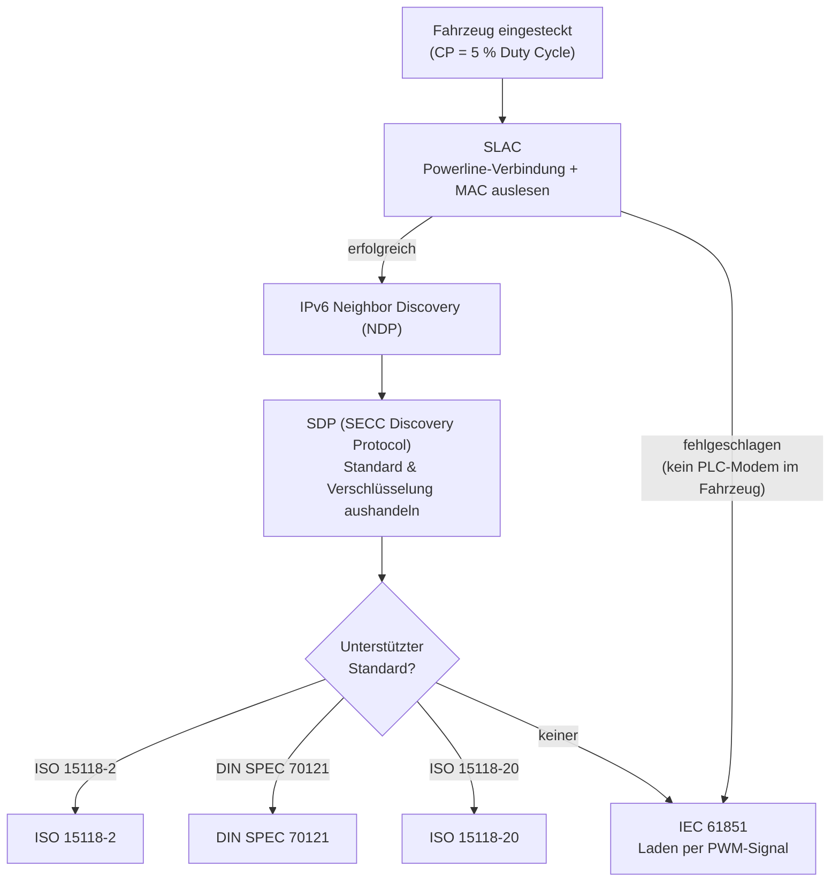

# ISO 15118 Details

import DeviceCompatibility from '@site/src/components/DeviceCompatibility';

<DeviceCompatibility supported={['wc4']} />

Der WARP4 Charger kann über ISO 15118 digital mit dem Fahrzeug kommunizieren –
zusätzlich zum klassischen Laden per PWM-Signal. Darüber liest er die MAC-Adresse
des Fahrzeugs (für **Autocharge**) und dessen Ladestand (**State of Charge, SoC**)
aus. Diese Seite erklärt, wie diese Kommunikation abläuft, welche Standards es dafür
gibt, worin sie sich unterscheiden und was der WARP Charger aktuell daraus macht.

:::tip

Wie SoC-Anzeige und Autocharge eingerichtet werden, zeigt das Tutorial
[SoC und Autocharge](/docs/tutorials/soc_autocharge). Diese Seite geht eine Ebene
tiefer und erklärt die Technik dahinter.

:::

## Kommunikationsablauf

Steckt ein Fahrzeug ein, signalisiert die Wallbox über den Control Pilot (CP) mit
einem Tastgrad (Duty Cycle) von 5 %, dass sie zur digitalen Kommunikation bereit ist.
Der Control Pilot ist die Steuerleitung im Typ-2-/CCS-Stecker. Anschließend laufen
mehrere Schritte nacheinander ab:

1. **SLAC** (Signal-Level-Attenuation-Characterization) baut eine
   Powerline-Verbindung zwischen Fahrzeug und Wallbox auf. Powerline ist die
   Technik, die auch bei "Ethernet über die Steckdose" zum Einsatz kommt. Hier
   läuft sie über das Ladekabel. Bereits in diesem Schritt überträgt das
   Fahrzeug seine MAC-Adresse, womit **Autocharge** funktioniert.
2. **IPv6 Neighbor Discovery (NDP)** richtet die Netzwerkadressierung zwischen
   den beiden Teilnehmern ein.
3. **SDP** (SECC Discovery Protocol) ist der Schritt, in dem Fahrzeug und
   Wallbox festlegen, welcher der drei Standards (**DIN SPEC 70121**,
   **ISO 15118-2** oder **ISO 15118-20**) gesprochen wird und ob die Verbindung
   unverschlüsselt oder verschlüsselt aufgebaut wird.

Unterstützt das Fahrzeug gar kein Powerline-Modem (also weder DIN 70121 noch
ISO 15118), schlägt SLAC fehl und die Wallbox lädt ganz normal nach
**IEC 61851** (Laden per PWM-Signal über den CP). Das ist dasselbe Verfahren,
mit dem auch alle Fahrzeuge ohne ISO 15118 an einer Typ-2-Wallbox laden.

## Die drei Standards

Die eigentliche, "höhere" Kommunikation ist in drei aufeinander aufbauenden
Standards definiert. Welcher davon zum Einsatz kommt, hängt vom Fahrzeug ab.

Die **DIN SPEC 70121** ist der älteste der drei und der Vorgänger der
ISO-15118-Standards. Sie kommt vor allem bei Fahrzeugen zum Einsatz, die
ISO 15118-2 noch nicht beherrschen. Kann ein Fahrzeug überhaupt nicht per DC
(über CCS) laden, unterstützt es für gewöhnlich gar keine digitale Kommunikation
über den Control Pilot.

|  | DIN SPEC 70121 | ISO 15118-2 | ISO 15118-20 |
|--|:--:|:--:|:--:|
| Laden per DC | ✅ | ✅ | ✅ |
| Laden per AC | ❌ | ✅ | ✅ |
| SoC auslesen während DC-Ladung | ✅ | ✅ | ✅ |
| SoC auslesen während AC-Ladung | ❌ | ❌ | ✅ |
| Verschlüsselung | ❌ | optional | vorgeschrieben |

### DIN SPEC 70121

Vorgänger der ISO-15118-Standards. Laden ausschließlich per DC, SoC-Auslesen nur
während der DC-Ladung, keine Verschlüsselung.

### ISO 15118-2

Laden per AC oder DC, SoC-Auslesen nur während der DC-Ladung. Verschlüsselung
ist möglich, aber optional.

### ISO 15118-20

Laden per AC oder DC, SoC-Auslesen sowohl während der DC- als auch der
AC-Ladung. Verschlüsselung ist vorgeschrieben. Nach aktuellem Stand gehen wir
außerdem davon aus, dass mit ISO 15118-20 auch **bidirektionales Laden**
(V2H/V2G), also das Zurückspeisen aus dem Fahrzeug ins Haus- oder Stromnetz,
möglich sein wird.

Eine verschlüsselte Verbindung kann nur aufgebaut werden, wenn Wallbox und
Fahrzeug Zertifikate besitzen, die von einem gemeinsamen Root-Zertifikat
abgeleitet sind, dem beide vertrauen. Diese Zertifikate müssen regelmäßig (etwa
alle drei Monate) erneuert werden. Die Abnahmen, die man benötigt, um diese
Zertifikate zu bekommen und zu erneuern, laufen gerade erst an.

## Was der WARP Charger aktuell unterstützt

**Autocharge** funktioniert unabhängig vom verwendeten Protokoll, da die
MAC-Adresse bereits während SLAC übertragen wird.

Den **SoC** übertragen DIN SPEC 70121 und ISO 15118-2 nur während einer
DC-Ladung. Da der WARP Charger nicht per DC lädt, liest er den SoC über eine
kurze, "vorgetäuschte" DC-Ladung aus: Fahrzeug und Wallbox handeln nur so lange
DC-Parameter aus, bis das Fahrzeug seinen SoC meldet. Danach wird die Sitzung
beendet, **bevor** überhaupt DC-Leistung fließt. Die eigentliche Ladung läuft
anschließend ganz normal per AC (IEC 61851). Während dieser AC-Ladung kann der
[WARP4 Charger Pro](@current-charger/introduction) den SoC über seinen
eingebauten Stromzähler anhand der ins Fahrzeug geflossenen Energie selbst
weiterrechnen.

Aktuell gilt also, egal welchen Standard das Fahrzeug unterstützt: Es wird kurz
eine DC-Ladung gestartet, der SoC ausgelesen, die DC-Ladung wieder beendet und
danach per AC geladen.

Daraus ergeben sich einige Einschränkungen:

- **AC-Laden per ISO 15118-2** bringt gegenüber dem "normalen" Laden per PWM
  keine großen Vorteile und wird von vielen Fahrzeugen nur schlecht
  unterstützt. Es ist daher aktuell nicht sinnvoll.
- **Verschlüsselte Verbindungen** kann der WARP Charger noch nicht aufbauen
  (siehe [Ausblick](#ausblick)).
- Bietet ein Fahrzeug mehrere Standards gleichzeitig an, wählt die Wallbox
  derzeit in der Reihenfolge **ISO 15118-2 → DIN SPEC 70121 → ISO 15118-20**.
  ISO 15118-20 befindet sich noch im Teststadium, wird aber in Zukunft das
  bevorzugte Protokoll werden.

## Unter der Haube

Dieser Abschnitt richtet sich an technisch besonders Interessierte und erklärt
einige Details der Umsetzung.

### Hardware und Software-Stack

Die Powerline-Kommunikation übernimmt ein dedizierter HomePlug-Green-PHY-Modemchip
(Qualcomm QCA700X), der im WARP4 Charger verbaut ist.
HomePlug Green PHY ist die Powerline-Variante,
die ISO 15118 für die Kommunikation über das Control-Pilot-Signal vorschreibt.

Auf dem ESP32 läuft der komplette Protokoll-Stack: von SLAC über IPv6/UDP (SDP)
und IPv6/TCP bis zu den eigentlichen V2G-Nachrichten. Diese Nachrichten sind im
**EXI**-Format (Efficient XML Interchange) kodiert. Das De- und Kodieren
übernimmt die Bibliothek libcbv2g.

### SLAC: warum "Attenuation Characterization"?

Stehen mehrere Wallboxen nebeneinander, teilen sich ihre Powerline-Signale
gewissermaßen dasselbe physikalische Medium und können sich gegenseitig "hören".
SLAC misst daher die Signaldämpfung (Attenuation) zwischen Wallbox und Fahrzeug,
um sicherzustellen, dass tatsächlich das direkt eingesteckte Fahrzeug antwortet
und nicht ein Nachbar mithört. Erst nach dieser Charakterisierung steht fest,
welches Modem zu welchem Kabel gehört. Bereits hier überträgt das Fahrzeug seine
MAC-Adresse, die der WARP Charger für Autocharge verwendet.

### Autocharge ohne vollständigen Verbindungsaufbau

Für Autocharge wird nur die MAC-Adresse benötigt, die bereits während SLAC
übertragen wird. Der WARP Charger bricht daher, wenn nur Autocharge aktiviert
ist, den SLAC-Vorgang bewusst kurz vor
dem letzten Schritt ab und sendet die Match-Bestätigung (`CM_SLAC_MATCH.CNF`)
nicht. Würde er den Match bestätigen, würde das Fahrzeug dem Powerline-Netz
beitreten, eine vollständige V2G-Sitzung erwarten und erst nach einem
Timeout von rund 90 bis 100 Sekunden auf das normale Laden zurückfallen. Durch
den frühen Abbruch wechselt das Fahrzeug stattdessen zügig in den klassischen
Lademodus.

### SoC-Auslesen über eine vorgetäuschte DC-Sitzung

Wie oben beschrieben, übertragen DIN 70121 und ISO 15118-2 den SoC nur im Rahmen
einer DC-Ladung. Der WARP Charger handelt deshalb eine DC-Sitzung bis zur
*ChargeParameterDiscovery* aus. Dies ist der Schritt, in dem das Fahrzeug seinen aktuellen
Ladestand mitteilt. Sobald dieser Wert vorliegt, signalisiert die Wallbox dem
Fahrzeug mit `EVSE_Shutdown`, die Sitzung zu beenden.
Ignoriert ein Fahrzeug dieses Signal und versucht
weiterzuladen, antwortet die Wallbox auf die folgenden Schritte (CableCheck,
PreCharge, CurrentDemand) konsequent mit einer Fehlermeldung, sodass die Sitzung
in jedem Fall sicher endet. Falls das Fahrzeug auf keine dieser Nachrichten
reagiert, hört die Wallbox mit der Kommunikation auf und zwingt das Fahrzeug
in einen Timeout.

### Eigenheiten realer Fahrzeuge

In der Praxis verhalten sich Fahrzeuge sehr unterschiedlich. Beim Wechsel von der
ISO-15118-Kommunikation zurück auf das PWM-Laden setzt die Wallbox das CP-Signal
beispielsweise zunächst für rund zwei Sekunden auf 100 % ("dauerhaft an"), bevor
sie das eigentliche PWM-Signal anlegt. Manche Fahrzeuge, etwa solche auf der
VW-MEB-Plattform, akzeptieren ein neues PWM-Signal sonst nicht.
Solche Sonderfälle sind ein wesentlicher Grund, warum die
ISO-15118-Unterstützung schrittweise und mit vielen realen Fahrzeugen erprobt
ausgerollt wird.

## Ausblick

Folgende Funktionen sind in Vorbereitung bzw. langfristig geplant:

- **Laden über ISO 15118-20:** Für Fahrzeuge, die ISO 15118-20 unterstützen,
  wird es möglich sein, den SoC kontinuierlich auszulesen und direkt über ISO
  15118 zu laden, ohne Umweg über IEC 61851. Damit sind auch eine
  kontinuierliche SoC-Anzeige während der AC-Ladung, beliebige
  Phasenumschaltung und Ladeströme unter 6 A möglich.
- **Bidirektionales Laden (V2H/V2G):** Nach aktuellem Stand gehen wir davon aus,
  dass über ISO 15118-20 auch ins Haus- oder Stromnetz gespeist werden
  kann, sofern das Fahrzeug es unterstützt.
- **Verschlüsselte Verbindungen (TLS):** Sobald produktive Zertifikate verfügbar
  sind, kann die Wallbox verschlüsselte Verbindungen aufbauen und bevorzugt die
  höherwertigen Protokolle wählen.

## Weitere Informationen

- [SoC und Autocharge einrichten](/docs/tutorials/soc_autocharge) – Schritt-für-Schritt-Anleitung
- [ISO 15118 (Webinterface)](/docs/webinterface/wallbox/iso15118) – Einstellungen, Status und Diagnose
- [Fahrzeuge (Webinterface)](/docs/webinterface/users/vehicles) – Fahrzeug-Profile für Autocharge und SoC-Schätzung
