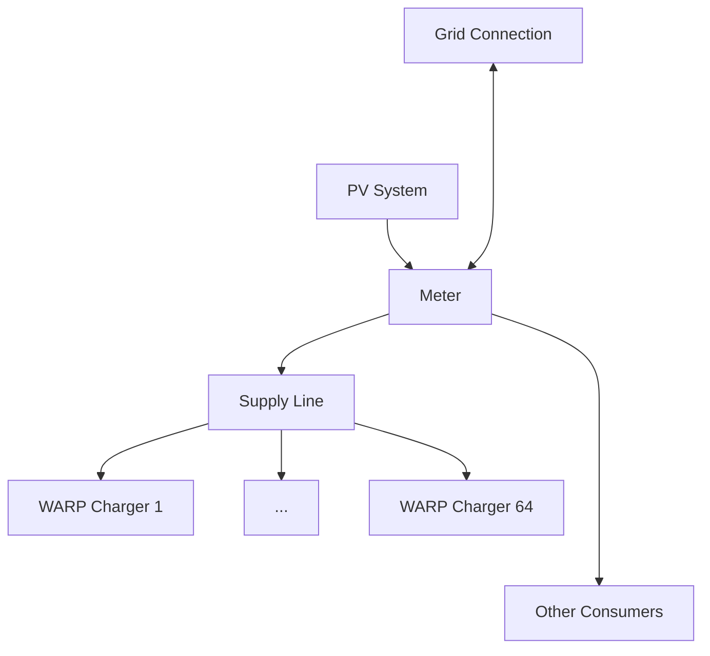

# Charge Management Details

:::danger

For configuration and operation of charge management and PV excess charging, it is **not** necessary to read and/or understand this page! This page documents internals of the design and behavior of static and dynamic load management and PV excess charging.

:::

Charge management can monitor the grid connection via a [compatible power meter](/compatible_devices/devices.mdx) and provides the following functions, which can be used individually or in combination:

- **Dynamic Load Management**: The charge manager ensures that the grid connection is not overloaded, even when other (uncontrolled) consumers dynamically load the grid connection.
- **PV Excess Charging**: The charge manager ensures that only PV excess is used to charge vehicles.
- **Static Load Management**: The charge manager ensures that the common supply line of the charger cluster is not overloaded.

The implementation balances multiple requirements:
- Fairness
- Control margin
- Utilization of PV excess
- Minimization of switch-on, switch-over, and switch-off operations
- Fast response to newly plugged-in vehicles
- Fast response to overload at the grid connection

Charge management is divided into two components: The controller determines current limits that specify how much PV excess is available and how heavily the three phases may be loaded. The distribution algorithm uses these current limits to allocate current to the chargers.

## Current Limits

Current limits each consist of a PV excess value and three phase values (L1, L2, L3).

The current limits determined by the controller are:
- `raw`: The current that may be used at this moment.
- `min`: The minimum available current of the last few minutes. The cloud filter configuration specifies how far back in time the `min` PV value is determined. For the phase values, the minimum of the last four minutes is always used.
- `max_pv`: The maximum available PV excess of the last few minutes. Also defined by the cloud filter.
- `spread`: A value that predicts how many chargers can be active simultaneously. Currently implemented as the minimum available current of the last hour.

## Controller

When PV excess charging or dynamic load management are active, the available current that may be distributed by charge management is calculated by two controllers that are part of the Power Manager module.

The PV controller is a P-controller with adaptive step size that reacts strongly to large deviations, for example to respond quickly to large consumers or suddenly changing cloud cover, and on the other hand reacts weakly to small deviations to avoid strong oscillations when a connected vehicle can only adjust its charging power in large, discrete steps. The setpoint of the controller is usually zero watts at the mains connection, but the value can be adjusted if needed to preferentially avoid drawing power from or feeding power to the grid. Since the available amount of energy for PV excess charging constantly fluctuates in cloudy weather, the strength of the cloud filter can be used to adjust how quickly chargers should be switched on, off, or over due to changing cloud cover or solar radiation. A weak cloud filter leads to more frequent switching operations, which allows better utilization of the actual PV power, but also causes more wear on the charging electronics of the connected vehicles. A strong cloud filter is gentler on the charging electronics, but leads to more power draw from or feed to the grid when the vehicles cannot be adjusted to the current PV power. The cloud filter values are passed to charge management as `min` and `max_pv`. As long as the charging power is in the middle range of charger and vehicle, the cloud filter has no effect.

The controller for dynamic load management is also a P-controller with adaptive step size that reacts strongly when the set phase limit is exceeded to avoid tripping the circuit breakers. Below the set phase limit, it slowly approaches the limit to allow more safety margin for consumers with pulsed power consumption, such as microwaves. Information about the grid connection to be monitored includes the rated value of the circuit breaker and the largest expected external consumer in the building. A typical value for grid connection protection is 63 A. A large external consumer could be a 27 kW instantaneous water heater, which must be expected to have a sudden power consumption of 39 A. In this case, dynamic load management may only load the grid connection with 49 A, since the water heater could be turned on at any time and the circuit breaker can only handle overload to a limited extent. For each phase, the minimum of the last four minutes is calculated individually and passed to charge management as `min` to estimate whether the grid connection capacity is sufficient to switch on additional chargers.

Dynamic load management does not use the current raw values of the phase currents, as in that case consumers with strongly pulsed power consumption would have either no influence or too strong an influence. Instead, interpolation is performed between a moving average of the last ten seconds and the weighted maximum from the same time interval. Small, pulsed consumers like coffee machines are thus smoothed, while large continuous consumers are immediately taken into account.

## Distribution Algorithm

The distribution algorithm works in nine stages, which for clarity are not explained in this order: First, only the "normal" distribution is explained, special cases follow afterwards. The nine stages are:

1. Switching off chargers that should be rotated, or are not active.
2. Immediately activating chargers to which a vehicle has just been plugged in.
3. Switching off chargers until phase and PV limits are maintained.
4. Switching on chargers until phase and PV limits are utilized.
5. Switching chargers from single-phase to three-phase until phase and PV limits are utilized.
6. Allocating the minimum current to all active chargers.
7. Allocating the fair current to all active chargers.
8. Allocating the remaining current to all active chargers.
9. Waking up chargers with "full" vehicles.

### Control Window

The distribution algorithm uses the current limits determined by the controller and the status reports of the controlled chargers to decide how many and which chargers may charge and how much current is allocated to them. For this purpose, the control window is determined, which indicates how much current can minimally and maximally be distributed by the currently active chargers.

As an example, consider two active chargers, one charging single-phase (with known phase rotation) that only loads L1, and one charging three-phase.

The window minimum is the sum of the minimum currents (typically 6 A) of the chargers on each phase. On the PV "phase", the sum of the phase minima must be output:

|PV|L1|L2|L3|
|-|-|-|-|
|24 A|12 A|6 A|6 A|

The underlying assumption here is that the three-phase minimum current equals the single-phase minimum current. This is the case when the `Standard` vehicle model is configured.

The window maximum depends on the determined `raw` current limit: More current than is currently available may never be distributed. Additionally, three-phase charging chargers may only be allocated enough current that at least the minimum current remains for the single-phase chargers. With a `raw` current limit of

|PV|L1|L2|L3|
|-|-|-|-|
|108 A|36 A|36 A|36 A|

the three-phase charging charger cannot be allocated more than 30 A, as otherwise less than 6 A would remain on L1 for the single-phase charging charger. The window maximum is therefore:

|PV|L1|L2|L3|
|-|-|-|-|
|96 A|36 A|30 A|30 A|

### Switching Off, On, and Over Chargers (Stages 3, 4, and 5)

After the control window has been determined, it is compared with the current limits to check (in this order) whether chargers must be switched off, can be switched on, or can be switched from single-phase to three-phase charging. After each switching decision, the control window is redetermined. Current is not yet distributed here; instead, the chargers are assigned zero (switched off), one, or three phases that they may load.

#### Stage 3

Chargers must be switched off when the control window minimum is greater than the `raw` current limit on one or more phases. If this is the case, then the corresponding phases are overloaded and immediate action must be taken. Chargers are also switched off when the PV control window minimum is greater than the `max_pv` current limit. The `raw` limit is not used here to ensure that chargers are not immediately switched off in case of a brief drop in PV production. In this case, power can be drawn from the grid to bridge the short drop.

#### Stage 4

Chargers can be switched on when the control window maximum cannot completely use up the available current. To switch on a charger, the **switch-on current** is first determined. By default, the switch-on current is 1.5 times the minimum current (`enable_current_factor_pct`), i.e. (for the `Standard` vehicle model) 9 A on each phase on which the new charger will be active, and the sum of the phase switch-on currents as the PV switch-on current. Three conditions are then checked:
1. Are the `min` current limits at least the switch-on current below the window minimum?
2. Does the `spread` current limit indicate that the new charger and all already active chargers could have been active?
3. Is the window maximum of at least one phase below the corresponding `min` current limit?
4. Is the window maximum of the PV value below the `min` current limit?

Either conditions 1 and 2 or 1, 3, and 4 must be met for a charger to be activated. Again, the `raw` current limit is not used here to ensure that the switch-on and immediately following switch-over decisions are stable for a certain time: It is preferable for a phase to not be fully loaded for a short time, or for some PV power to be fed into the grid, rather than having a charger activated and immediately deactivated again, so that the hardware of charger and vehicle is not excessively stressed.

#### Stage 5

A charger can be switched from single-phase to three-phase charging when current is still available. The decision is made almost the same way as whether a charger should be activated, but it is taken into account that the charger in question is already active on one phase, and condition 3 must apply to the *two* other phases.

### Current Distribution (Stages 6, 7, and 8)

After it has been determined for each charger whether it may charge and if so whether single-phase or three-phase, all currently active chargers are allocated current.

#### Stage 6

First, all chargers are allocated their respective minimum current so that the charging process continues or can begin. The switching decisions made above ensure that the minimum current is available for each charger that has been assigned at least one phase. The allocated currents are now subtracted from the `raw` limit.

#### Stage 7

Next, a fair current per phase and for the PV excess is determined. The fair current is the remaining `raw` limit divided by the number of chargers that are active on this phase. For PV excess, a charger counts with the number of its active phases, so that single-phase charging chargers are not disadvantaged.

For example, if one three-phase and one single-phase (on L1) charging charger are active, and the `raw` current limit *after distribution of minimum currents* is still

|PV|L1|L2|L3|
|-|-|-|-|
|68 A|50 A|20 A|10 A|

then the following fair current is calculated:

|PV|L1|L2|L3|
|-|-|-|-|
|17 A|25 A|20 A|10 A|

Each charger is allocated the minimum of the fair PV excess current and the fair current of the phases on which it is active, and this is subtracted from the `raw` current limit. In the example, the three-phase charger is allocated 10 A (limited by L3) and the single-phase charger is allocated 17 A (limited by PV).

The `raw` current limit is now still:

|PV|L1|L2|L3|
|-|-|-|-|
|21 A|23 A|10 A|0 A|

#### Stage 8

The remaining current is now distributed, possibly unfairly, to the chargers. Since no more current is available on L3, the three-phase charging charger cannot be allocated more current. It therefore retains the allocation of 6 A (minimum current) + 10 A (fair current) = 16 A. The single-phase charging charger can still receive 21 A of PV excess that is available on the L1 phase. It is therefore allocated 6 A (minimum current) + 16 A (fair current) + 21 A (remaining current) = 43 A. This value is limited to 32 A, which is the maximum that can be allocated to a (22kW) charger.

The `raw` current limit is now still:

|PV|L1|L2|L3|
|-|-|-|-|
|11 A|2 A|10 A|0 A|

### Waking Up "Full" Vehicles (Stage 9) {#wakeup}

Due to the limited communication between vehicle and charger, it cannot be determined when a vehicle is fully charged. When a vehicle terminates charging during an ongoing charging process, charge management therefore assumes that the vehicle is full, or for other reasons (charging limit, overheating) no longer wants to receive current. When the vehicle terminates charging, its charger is therefore considered low priority and the charger is not allocated current in the normal pass of the distribution algorithm.

If current is still available after the distribution pass, this current is allocated to chargers to which "full" vehicles are connected, so that they can charge again if necessary. For example, the vehicle's auxiliary heater may have been activated, or the vehicle can be charged again due to self-discharge.

If, as in the example above, the `raw` current limit after the distribution pass is still

|PV|L1|L2|L3|
|-|-|-|-|
|11 A|2 A|10 A|0 A|

then the switch-on current (see above) can be allocated to a low-priority charger that can charge single-phase on L2. If there are more low-priority chargers than current available, the charger to which the switch-on current is allocated is rotated after a few minutes (the `wakeup_time`, default three minutes).

### Rotation of Chargers (Stage 1)

Due to the PV and phase limits, it may occur that not all chargers that are ready to charge also receive current. To ensure in this case that all vehicles receive a fair share of the available energy, chargers can be rotated, i.e. deactivated, so that other ready-to-charge chargers can charge.

A charger is ready to charge when
- it is not low priority [(see Waking Up "Full" Vehicles)](#wakeup),
- a vehicle was already connected during the last distribution pass and still is,
- this charger was not allocated current in the last distribution pass and
- no charging current limit of the charger *except that of charge management* is blocking.

As soon as at least one charger is ready to charge, each currently charging charger is checked whether
1. it is active on at least one of the phases that would be used by the ready-to-charge charger,
2. the charger has been active for a certain minimum time (`minimum_active_time`, default 15 minutes) and
3. the charger has been allocated a certain minimum energy (`alloc_energy_rot_thres`, default 5 kWh).

A charger that meets these conditions is rotated, i.e. it is deactivated to activate the ready-to-charge charger instead.

### Activation When Plugging In a Vehicle (Stage 2)

A charger to which a vehicle is plugged in is considered high priority. This ensures that the vehicle's charging electronics do not go to sleep (which, depending on the vehicle, can happen a few minutes after plugging in if charging has not started) and the charger user receives quick feedback that their charging is running, as the contactor switches immediately.

Stage 2 of the distribution algorithm activates high-priority chargers immediately. This activation occurs before [Stage 3 (Switching Off Chargers in Case of Overload)], which then ensures that the phase and PV limits are not exceeded.

A charger is no longer considered high priority when it has been charging for a certain time (`plug_in_time`, default three minutes).

### Global Hysteresis

To avoid too frequent switching operations even with fluctuating current limits, a global hysteresis time (`global_hysteresis`, default three minutes) is used. If the hysteresis time has not elapsed, no chargers are switched on, switched from single-phase to three-phase charging, or switched off due to the PV limit. Each switch-off, switch-on, and switch-over operation resets the hysteresis time. Switch-off operations due to phase limits are always possible.
