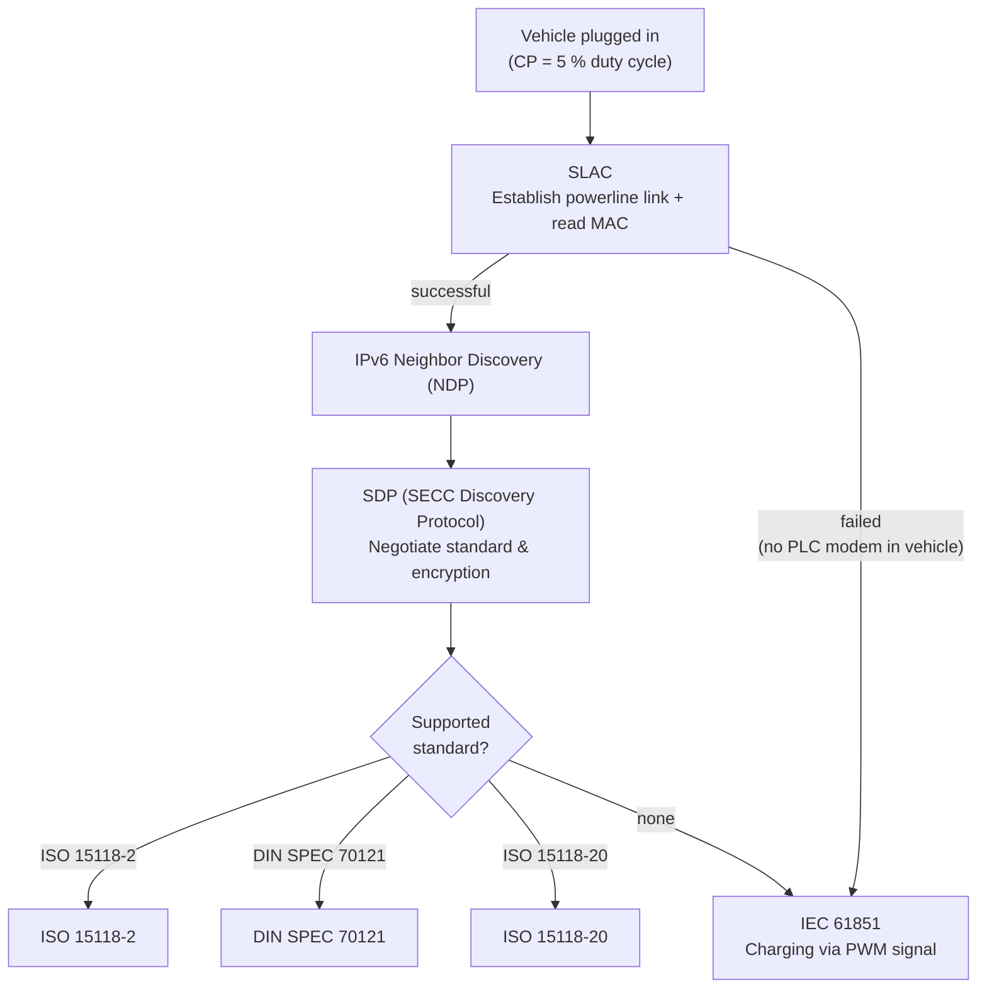

# ISO 15118 Details

import DeviceCompatibility from '@site/src/components/DeviceCompatibility';

<DeviceCompatibility supported={['wc4']} />

The WARP4 Charger can communicate digitally with the vehicle via ISO 15118 – in addition
to classic charging via the PWM signal. Through this, it reads out the vehicle's MAC
address (for **Autocharge**) and its state of charge (**SoC**). This page explains how
this communication works, which standards exist for it, how they differ, and what the WARP
charger currently does with them.

:::tip

How to set up the SoC display and Autocharge is shown in the tutorial
[SoC and Autocharge](/tutorials/soc_autocharge.md). This page goes one level deeper and
explains the technology behind it.

:::

## Communication flow

When a vehicle plugs in, the charger signals via the control pilot (CP) with a duty cycle
of 5 % that it is ready for digital communication. The control pilot is the signal line in
the Type 2 / CCS connector. Several steps then run one after another:

1. **SLAC** (Signal-Level-Attenuation-Characterization) establishes a powerline connection
   between vehicle and charger. Powerline is the technology that is also used for "Ethernet
   over the power socket". Here it runs over the charging cable. Already in this step, the
   vehicle transmits its MAC address, which is what makes **Autocharge** work.
2. **IPv6 Neighbor Discovery (NDP)** sets up the network addressing between the two
   participants.
3. **SDP** (SECC Discovery Protocol) is the step in which vehicle and charger determine
   which of the three standards (**DIN SPEC 70121**, **ISO 15118-2**, or **ISO 15118-20**)
   is spoken and whether the connection is established unencrypted or encrypted.

If the vehicle has no powerline modem at all (i.e. neither DIN 70121 nor ISO 15118), SLAC
fails and the charger charges normally according to **IEC 61851** (charging via PWM signal
on the CP). This is the same method used by all vehicles without ISO 15118 charging at a
Type 2 charger.

## The three standards

The actual, "higher-level" communication is defined in three standards that build on one
another. Which of them is used depends on the vehicle.

**DIN SPEC 70121** is the oldest of the three and the predecessor of the ISO 15118
standards. It is used above all by vehicles that do not yet support ISO 15118-2. If a
vehicle cannot charge via DC (over CCS) at all, it usually does not support any digital
communication over the control pilot.

|  | DIN SPEC 70121 | ISO 15118-2 | ISO 15118-20 |
|--|:--:|:--:|:--:|
| DC charging | ✅ | ✅ | ✅ |
| AC charging | ❌ | ✅ | ✅ |
| Read SoC during DC charging | ✅ | ✅ | ✅ |
| Read SoC during AC charging | ❌ | ❌ | ✅ |
| Encryption | ❌ | optional | mandatory |

### DIN SPEC 70121

Predecessor of the ISO 15118 standards. Charging exclusively via DC, reading the SoC only
during DC charging, no encryption.

### ISO 15118-2

Charging via AC or DC, reading the SoC only during DC charging. Encryption is possible, but
optional.

### ISO 15118-20

Charging via AC or DC, reading the SoC during both DC and AC charging. Encryption is
mandatory. Based on the current state, we also assume that ISO 15118-20 will make
**bidirectional charging** (V2H/V2G) possible, i.e. feeding energy back from the vehicle
into the home or grid.

An encrypted connection can only be established if the charger and the vehicle have
certificates derived from a common root certificate that both trust. These certificates
have to be renewed regularly (roughly every three months). The approvals required to obtain
and renew these certificates are only just getting started.

## What the WARP charger currently supports

**Autocharge** works regardless of the protocol used, since the MAC address is already
transmitted during SLAC.

The **SoC** is only transmitted by DIN SPEC 70121 and ISO 15118-2 during a DC charging
session. Since the WARP charger does not charge via DC, it reads the SoC via a short,
"faked" DC charging session: vehicle and charger only negotiate DC parameters long enough
for the vehicle to report its SoC. The session is then ended **before** any DC power flows
at all. The actual charging afterwards runs completely normally via AC (IEC 61851). During
this AC charging, the [WARP4 Charger Pro](@current-charger/introduction) can keep
calculating the SoC itself via its built-in energy meter, based on the energy that has
flowed into the vehicle.

So currently, regardless of which standard the vehicle supports: a DC charging session is
briefly started, the SoC is read out, the DC charging session is ended again, and charging
then continues via AC.

This results in a few limitations:

- **AC charging via ISO 15118-2** offers no major advantages over "normal" charging via
  PWM and is only poorly supported by many vehicles. It is therefore currently not useful.
- **Encrypted connections** cannot yet be established by the WARP charger (see
  [Outlook](#outlook)).
- If a vehicle offers several standards at the same time, the charger currently selects
  them in the order **ISO 15118-2 → DIN SPEC 70121 → ISO 15118-20**. ISO 15118-20 is still
  in the testing stage, but will become the preferred protocol in the future.

## Under the hood

This section is aimed at the especially technically interested reader and explains some
details of the implementation.

### Hardware and software stack

The powerline communication is handled by a dedicated HomePlug Green PHY modem chip
(Qualcomm QCA700X) built into the WARP4 Charger. HomePlug Green PHY is the powerline
variant that ISO 15118 prescribes for communication over the control pilot signal.

The complete protocol stack runs on the ESP32: from SLAC over IPv6/UDP (SDP) and IPv6/TCP
up to the actual V2G messages. These messages are encoded in the **EXI** format (Efficient
XML Interchange). The decoding and encoding is handled by the libcbv2g library.

### SLAC: why "Attenuation Characterization"?

When several chargers stand next to one another, their powerline signals share, in a sense,
the same physical medium and can "hear" each other. SLAC therefore measures the signal
attenuation between charger and vehicle to ensure that the directly plugged-in vehicle is
actually the one responding, and not a neighbor listening in. Only after this
characterization is it clear which modem belongs to which cable. Already here, the vehicle
transmits its MAC address, which the WARP charger uses for Autocharge.

### Autocharge without a full connection setup

For Autocharge, only the MAC address is needed, which is already transmitted during SLAC.
When only Autocharge is enabled, the WARP charger therefore deliberately aborts the SLAC
process just before the last step and does not send the match confirmation
(`CM_SLAC_MATCH.CNF`). If it confirmed the match, the vehicle would join the powerline
network, expect a full V2G session, and only fall back to normal charging after a timeout
of around 90 to 100 seconds. Thanks to the early abort, the vehicle instead switches
quickly to the classic charging mode.

### Reading the SoC via a faked DC session

As described above, DIN 70121 and ISO 15118-2 only transmit the SoC as part of a DC
charging session. The WARP charger therefore negotiates a DC session up to
*ChargeParameterDiscovery*. This is the step in which the vehicle reports its current state
of charge. As soon as this value is available, the charger signals the vehicle with
`EVSE_Shutdown` to end the session. If a vehicle ignores this signal and tries to keep
charging, the charger consistently responds to the following steps (CableCheck, PreCharge,
CurrentDemand) with an error, so that the session ends safely in any case. If the vehicle
does not react to any of these messages, the charger stops communicating and forces the
vehicle into a timeout.

### Quirks of real-world vehicles

In practice, vehicles behave very differently. When switching from ISO 15118 communication
back to PWM charging, the charger first sets the CP signal to 100 % ("permanently on") for
about two seconds, for example, before applying the actual PWM signal. Some vehicles, for
example those on the VW MEB platform, would otherwise not accept a new PWM signal. Such
special cases are a key reason why ISO 15118 support is being rolled out gradually and
tested with many real vehicles.

## Outlook

The following functions are in preparation or planned for the long term:

- **Charging via ISO 15118-20:** For vehicles that support ISO 15118-20, it will be
  possible to read the SoC continuously and to charge directly via ISO 15118, without the
  detour through IEC 61851. This also enables a continuous SoC display during AC charging,
  arbitrary phase switching, and charging currents below 6 A.
- **Bidirectional charging (V2H/V2G):** Based on the current state, we assume that
  ISO 15118-20 will also allow feeding energy back into the home or grid, provided the
  vehicle supports it.
- **Encrypted connections (TLS):** As soon as productive certificates are available, the
  charger can establish encrypted connections and preferentially choose the higher-grade
  protocols.

## Further information

- [Setting up SoC and Autocharge](/tutorials/soc_autocharge.md) – step-by-step guide
- [ISO 15118 (web interface)](/webinterface/wallbox/iso15118.md) – settings, status, and diagnostics
- [Vehicles (web interface)](/webinterface/users/vehicles.md) – vehicle profiles for Autocharge and SoC estimation
